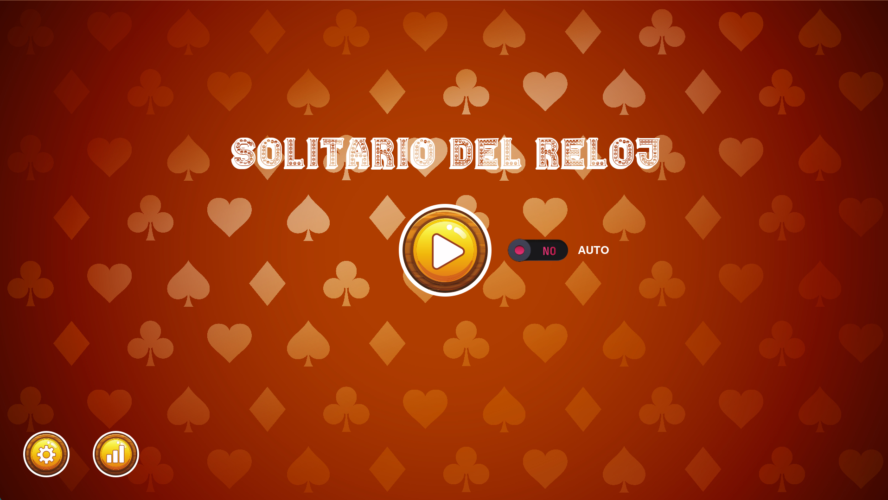

Collecting workspace information

# Clock Solitaire

Clock Solitaire is a card game implemented using Python and Pygame. The game simulates the classic solitaire game with a clock layout. The objective is to arrange the cards in a specific order to win the game.

## Features

- **Clock Layout**: The cards are arranged in a circular clock layout.
- **Card Animations**: Smooth animations for shuffling and dealing cards.
- **Sound Effects**: Includes sound effects for shuffling and dealing cards.
- **Background Music**: Background music that plays during the game.
- **Automatic and Manual Modes**: Play the game manually or let the game play automatically.
- **Win and Lose Screens**: Displays a win or lose screen based on the game outcome.

## Installation

1. Clone the repository:
    ```sh
    git clone https://github.com/geovannyIsma/Clock-Solitaire.git
    cd Clock-Solitaire
    ```

2. Install the required dependencies:
    ```sh
    pip install -r requirements.txt
    ```

## How to Play

1. Run the game:
    ```sh
    python main.py
    ```

2. The game will start with a main menu. You can choose to play the game, configure settings, or view statistics.

3. During the game, you can drag and drop cards to their respective positions. The goal is to arrange the cards in the correct order to win.

## Screenshots

### Main Menu


### Game


## Dependencies

- Python 3.x
- Pygame
- OpenAI API (for generating responses)


## Acknowledgements

- Pygame for providing the game development library.
- OpenAI for the API used in generating responses.

Enjoy playing Clock Solitaire!